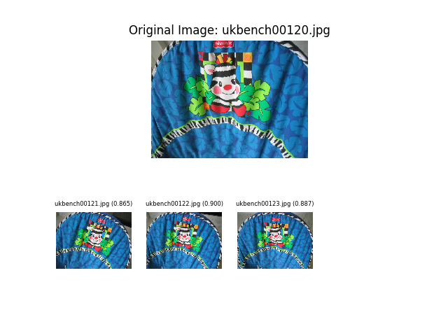

# Image Deduplicator (imagededup)

[](https://dev.azure.com/axelspringerai/Public/_build/latest?definitionId=1&branchName=master)
[](https://travis-ci.org/idealo/imagededup)
[](https://idealo.github.io/imagededup/)
[](https://codecov.io/gh/idealo/imagededup)
[](https://pypi.org/project/imagededup/)
[](https://github.com/idealo/imagededup/blob/master/LICENSE)

imagededup is a python package that simplifies the task of finding **exact** and **near duplicates** in an image collection.

<p align="center">
  
</p>

This package provides functionality to make use of hashing algorithms that are particularly good at finding exact
duplicates as well as convolutional neural networks which are also adept at finding near duplicates. An evaluation
framework is also provided to judge the quality of deduplication for a given dataset.

Following details the functionality provided by the package:

- Finding duplicates in a directory using one of the following algorithms:
    - [Convolutional Neural Network](https://arxiv.org/abs/1704.04861) (CNN)
    - [Perceptual hashing](http://www.hackerfactor.com/blog/index.php?/archives/432-Looks-Like-It.html) (PHash)
    - [Difference hashing](http://www.hackerfactor.com/blog/index.php?/archives/529-Kind-of-Like-That.html) (DHash)
    - [Wavelet hashing](https://fullstackml.com/wavelet-image-hash-in-python-3504fdd282b5) (WHash)
    - [Average hashing](http://www.hackerfactor.com/blog/index.php?/archives/432-Looks-Like-It.html) (AHash)
- Generation of encodings for images using one of the above stated algorithms.
- Framework to evaluate effectiveness of deduplication  given a ground truth mapping.
- Plotting duplicates found for a given image file.

Detailed documentation for the package can be found at: [https://idealo.github.io/imagededup/](https://idealo.github.io/imagededup/)

imagededup is compatible with Python 3.6+ and runs on Linux, MacOS X and Windows. 
It is distributed under the Apache 2.0 license.

## 📖 Contents
- [Installation](#%EF%B8%8F-installation)
- [Quick Start](#-quick-start)
- [Benchmarks](#-benchmarks)
- [Contribute](#-contribute)
- [Citation](#-citation)
- [Maintainers](#-maintainers)
- [License](#-copyright)

## ⚙️ Installation
There are two ways to install imagededup:

* Install imagededup from PyPI (recommended):

```
pip install imagededup
```

> ⚠️ **Note**: The TensorFlow >=2.1 and TensorFlow 1.15 release now include GPU support by default.
> Before that CPU and GPU packages are separate. If you have GPUs, you should rather
> install the TensorFlow version with GPU support especially when you use CNN to find duplicates.
> It's way faster. See the [TensorFlow guide](https://www.tensorflow.org/install/gpu) for more
> details on how to install it for older versions of TensorFlow.

* Install imagededup from the GitHub source:

```bash
git clone https://github.com/idealo/imagededup.git
cd imagededup
pip install "cython>=0.29"
python setup.py install
```  

## 🚀 Quick Start

In order to find duplicates in an image directory using perceptual hashing, following workflow can be used:

- Import perceptual hashing method

```python
from imagededup.methods import PHash
phasher = PHash()
```

- Generate encodings for all images in an image directory

```python
encodings = phasher.encode_images(image_dir='path/to/image/directory')
```

- Find duplicates using the generated encodings

```python
duplicates = phasher.find_duplicates(encoding_map=encodings)
```

- Plot duplicates obtained for a given file (eg: 'ukbench00120.jpg') using the duplicates dictionary

```python
from imagededup.utils import plot_duplicates
plot_duplicates(image_dir='path/to/image/directory',
                duplicate_map=duplicates,
                filename='ukbench00120.jpg')
```
The output looks as below:

<p align="center">
  
</p>


The complete code for the workflow is:
```python
from imagededup.methods import PHash
phasher = PHash()

# Generate encodings for all images in an image directory
encodings = phasher.encode_images(image_dir='path/to/image/directory')

# Find duplicates using the generated encodings
duplicates = phasher.find_duplicates(encoding_map=encodings)

# plot duplicates obtained for a given file using the duplicates dictionary
from imagededup.utils import plot_duplicates
plot_duplicates(image_dir='path/to/image/directory',
                duplicate_map=duplicates,
                filename='ukbench00120.jpg')
```
For more examples, refer [this](https://github.com/idealo/imagededup/tree/master/examples) part of the
repository.

For more detailed usage of the package functionality, refer: [https://idealo.github.io/imagededup/](https://idealo.github.io/imagededup/)

## ⏳ Benchmarks
Detailed benchmarks on speed and classification metrics for different methods have been provided in the [documentation](https://idealo.github.io/imagededup/user_guide/benchmarks/).
Generally speaking, following conclusions can be made:

- CNN works best for near duplicates and datasets containing transformations.
- All deduplication methods fare well on datasets containing exact duplicates, but Difference hashing is the fastest.

## 🤝 Contribute
We welcome all kinds of contributions.
See the [Contribution](CONTRIBUTING.md) guide for more details.

## 📝 Citation
Please cite Imagededup in your publications if this is useful for your research. Here is an example BibTeX entry:
```BibTeX
@misc{idealods2019imagededup,
  title={Imagededup},
  author={Tanuj Jain and Christopher Lennan and Zubin John and Dat Tran},
  year={2019},
  howpublished={\url{https://github.com/idealo/imagededup}},
}
```

## 🏗 Maintainers
* Tanuj Jain, github: [tanujjain](https://github.com/tanujjain)
* Christopher Lennan, github: [clennan](https://github.com/clennan)
* Dat Tran, github: [datitran](https://github.com/datitran)

## © Copyright
See [LICENSE](LICENSE) for details.
